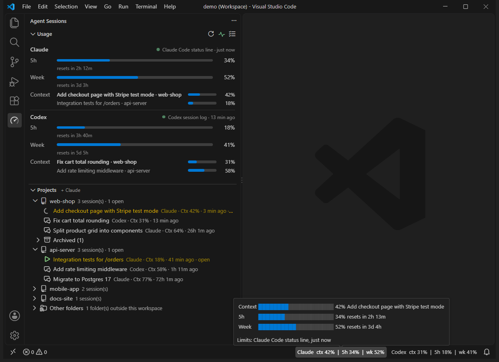
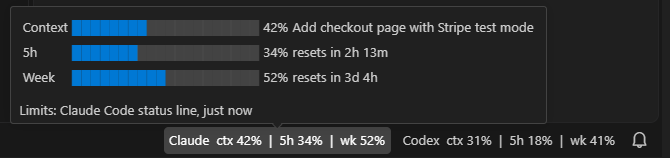
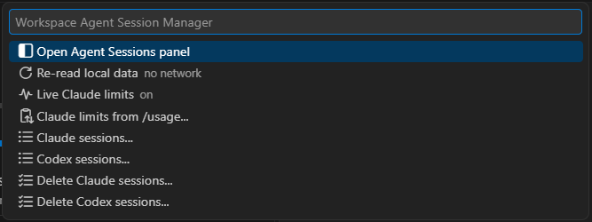
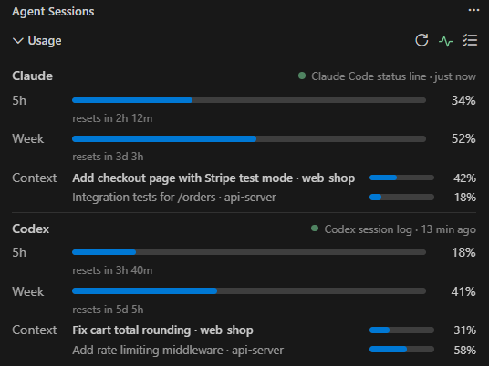
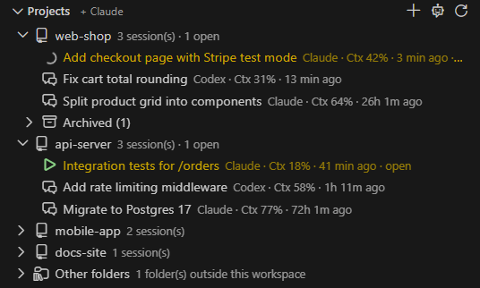
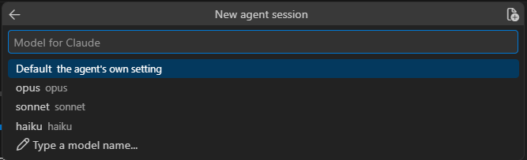
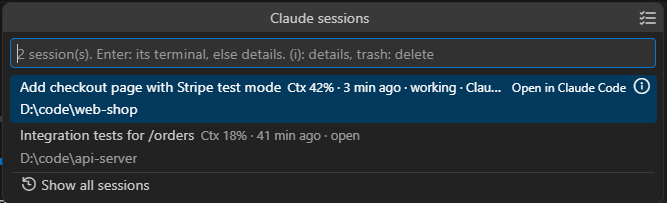

# Workspace Agent Session Manager

Every AI coding agent session of your workspace in one place, grouped by repo, with how much context, 5-hour and weekly allowance it has used. Built in: **Claude Code** and **OpenAI Codex**. Other agents can be added by other extensions.

- **Every folder of a multi-root workspace.** The Claude Code panel starts and lists sessions of the first folder only; here each repo gets its own sessions, and new ones start in the right folder.
- **Both agents, side by side.** Claude Code and Codex sessions in one tree, their limits in one view, following the terminal you are in.
- **Nothing leaves your machine.** It reads the files the agents already keep on disk and runs their own CLIs. No network requests, no telemetry, no API keys, and it never reads your agent logins.



## Features

- **Projects view**: every agent's sessions grouped by repo, multi-root workspaces included. Start, resume, close, rename, archive and delete sessions; the active terminal's session is highlighted, and one already running opens its terminal instead of starting twice.
- **Status bar**: context / 5h / weekly usage per agent, following the session in the active terminal. Turns yellow at 80%, red at 95%.
- **Live Claude limits** (opt-in): fresh 5h / weekly numbers on every Claude Code reply, from Claude Code's own status line. Or paste them from `/usage`.
- **Usage view**: the same numbers as bars with reset times; with several open sessions, one context bar per session.
- **Sessions list**: open or all sessions with their context use, details and bulk delete.
- **Agent terminal toolbar**: `/context`, `/usage`, `/compact`, `/model`, mode switch and a menu of the agent's slash commands, for agent terminals started from here.

## Requirements

- VS Code 1.93 or later.
- Claude Code and/or OpenAI Codex used on this machine, as a VS Code extension or a CLI. An agent that has never run here is not shown.
- To start or resume sessions in a terminal, the agent's CLI:
  - Claude: `~/.local/bin/claude`, else the copy bundled with the Claude Code extension, else `claude` on PATH.
  - Codex: the copy bundled with the OpenAI (ChatGPT) extension, else `codex` on PATH.
- Developed and tested on Windows. macOS and Linux work with the limits listed under [Known limitations](#known-limitations).

## Status bar

- **ctx** = % of the active session's context window used
- **5h / wk** = % of the 5-hour / weekly allowance used
- `~` = the limit reading is older than `workspaceAgentSessions.claudeLimitsMaxAgeMinutes` and may be outdated
- `—` = not reliably determinable

**Hover** an item for the same bars as the Usage view, with the session's name, reset times and where the limits came from.



The items sit at the **bottom-right of the status bar** (it must be visible: *View → Appearance → Status Bar*). Right-click the status bar to hide an agent.

They follow the **active terminal**: with several agent terminals in one window (e.g. one per repo), switching terminals switches the numbers to that terminal's session. Terminals started from the Projects view are matched exactly: by the resumed session id, by the agent's process id (Claude), or by the terminal's start time (Codex, whose sessions carry no process id). For other terminals, the folder picks the newest session there. Without a matching session, the newest session of the workspace is shown, never one from another repo.

Hover for reset times and data age. Click for the menu: open the panel, re-read local data, Claude plan usage, agent commands, the sessions lists, bulk delete.



## Live Claude limits

Claude Code keeps its 5h / weekly numbers in memory only, so without help they go stale (shown faded, with a `~`). It does hand them to its **status line** command on every reply. Turn on *Live Claude limits* (status bar menu, or the pulse button in the Usage view) and the extension:

- sets Claude Code's status line in `~/.claude/settings.json` to a small script in `~/.claude/agent-sessions/`, which saves what Claude Code passes in and prints `ctx 31% · 5h 69% · wk 49%` under the prompt;
- keeps your previous status line, if you had one, and puts it back when you turn this off (it asks first, and shows what it replaces).

The confirmation names the script file and the exact command written to `settings.json`; **Show Script** opens the script's full text before anything is written (`statusline.ps1` on Windows, `statusline.sh` elsewhere). The pulse button in the Usage view is **yellow** until you have answered once (on, off, or /usage instead), then **green** when on and **dimmed grey** when off. If something else replaces the status line later, you are told once. Next to each agent's name, a dot of the same colours says how fresh its 5h / weekly numbers are.

**Rather not run a script?** Use *Claude limits from /usage* (status bar menu, the command palette, or *Use /usage Instead* in the dialog above). Run `/usage` in Claude Code, select the dialog's text and copy it; the extension reads the clipboard, shows what it understood, and saves it after you confirm. If you started that Claude Code terminal from here, it types `/usage` for you. Such a reading is a snapshot: it ages like any other and fades after an hour. Claude Code's `/usage` dialog writes nothing to disk, so there is no way to pick it up without the copy.

It works while Claude Code runs **in a terminal**: the Claude Code panel in VS Code runs no status line. Limits are per account, so one terminal session keeps the numbers fresh for all of them. Sessions already running may need a restart to pick it up. Turn it off before uninstalling the extension to get your old status line back.

## Data sources

| Value | Codex | Claude Code |
|---|---|---|
| Active session | the active terminal's session (by id, else its folder), else the newest main-thread rollout in `~/.codex/sessions/YYYY/MM/DD/` (last 7 day folders; subagent threads skipped; workspace preferred) | running sessions in `~/.claude/sessions/<pid>.json` → `~/.claude/projects/<cwd>/<id>.jsonl` (the active terminal's session by id / pid / folder first, then the workspace's); else the newest transcript of the workspace |
| Context used | last `token_count` event: `last_token_usage.total_tokens / model_context_window` | last main-chain assistant `message.usage`: input + cache creation + cache read tokens ÷ context window (from a `/usage` report, a `[1m]` model suffix, or the `workspaceAgentSessions.claudeContextWindows` setting) |
| 5h / weekly | newest `token_count.rate_limits` (windows of 300 / 10080 minutes): `used_percent`, `resets_at` | newest of: *Live Claude limits* (above), *Claude limits from /usage* (above), a `/usage` report in the active transcript, or `~/.claude/vscode-claude-status-cache.json` (written by the *vscode-claude-status* extension, if installed) |

Without one of these sources, Claude's 5h / wk show `—`. Readings older than `workspaceAgentSessions.claudeLimitsMaxAgeMinutes` (default 60) get a `~`: usage only grows within a window, so an old reading may understate it. A window whose reset time has passed shows `0%` until fresh data arrives.

## Usage view

The **Agent Sessions** icon in the activity bar opens two views (drag them to the secondary side bar or the panel if you like; right-click the activity bar to hide the icon).

**Usage** shows 5h, week and context per agent, with reset times and where the limits came from. Click an agent for its sessions list. From two open sessions on, *Context* splits into one row per session, each with its name and its own bar; the active terminal's row is highlighted. Click a row to jump to its terminal, or to see its details when it has none. Title bar: refresh, *Live Claude limits*, delete several sessions.



## Projects view

The Claude Code panel only starts and lists sessions of the **first** workspace folder. The Projects view lists each workspace folder (with no folder open, each session's folder) with the sessions of every agent. Sessions started outside the workspace are listed under *Other folders*.



- **+** in the title bar: new session. Pick the agent, repo, model and effort; the *Attach files* button on each step adds files to the first message.
- **+** on a repo: new session there. It starts the agent set in `workspaceAgentSessions.defaultAgent` at once, or asks. The view title says which (*Projects + Claude*); the robot button in the title bar changes it. Right-click the repo for the full menu, including the agent's own panel.
- **⧉** on a repo: open the repo in its own window (for the agent's panel there).
- Click a session: its terminal if it runs in one of this window's terminals, else resume it in a new terminal (archived sessions and ones open elsewhere show their details instead).
- The session of the **active terminal** is highlighted, and selected as you switch terminals. Also for Claude Code started by hand in a shell, and for terminals from before a window reload.
- On a closed session: **▶** resume in a terminal in its repo, **✎** rename, **archive**, **delete** (Claude Code and Codex show the new name too).
- On a session started from here and still open: `/context`, `/compact`, `/model`, **✎** rename (through the agent's own `/rename`), and **✕** to close its terminal. Its right-click menu adds the slash-command menu.
- Right-click any session for its details.
- Sessions open outside this window's terminals (the Claude panel, the Codex app, another window) are tinted. They can't be closed from here, and resuming them would start a second process on the same conversation.
- *Archived (n)* under each repo: **unarchive**, **delete**.
  - Codex: `codex archive` / `codex unarchive` (moves to / from `~/.codex/archived_sessions`).
  - Claude has no archive of its own: the transcript is moved to `~/.claude/archived-sessions/` and back. Until it is unarchived, Claude Code doesn't list it.



## Sessions list

Click a status bar item → **Claude sessions... / Codex sessions...** (or *Agent Sessions: Show Sessions...*):



- Opens with the **open** sessions and each one's context used:
  - Claude: sessions loaded in a running Claude Code process (e.g. an open panel tab), shown as `working` or `open`.
  - Codex: sessions loaded in a running Codex process (Windows only, see below), plus any active in the last 24 hours.
- **Show all sessions** lists every session; **←** goes back.
- Sessions running in one of this window's terminals are marked with a terminal icon; **Enter** goes to that terminal instead of starting the session again. The list opens on the active terminal's session.
- Per row: **(i)** details (tokens / window, model, last activity, folder), **trash** to delete.
- **☑** in the title bar (also in the menu and the Usage view): tick several closed sessions and delete them with one confirmation.

## Agent terminals

While an agent terminal started from here is active, its toolbar gets buttons for that agent's commands: `/context` and `/usage` (Claude), `/compact` (asks first, since it can't be undone), `/model`, the mode switch (Shift+Tab), and a menu with the rest of the agent's slash commands. Claude's `/usage` button then offers *Read Clipboard*: copy the dialog and its numbers go to the Usage view (`/usage` itself saves nothing).

## Settings

| Setting | Default | |
|---|---|---|
| `workspaceAgentSessions.defaultAgent` | *(empty)* | Agent that **+** on a repo starts at once (`claude`, `codex`, or a registered provider's id). Empty asks each time. |
| `workspaceAgentSessions.claudeContextWindows` | current Claude models | Context window (tokens) per Claude model id prefix. Claude Code doesn't record it per turn; models not listed show `—` for context. |
| `workspaceAgentSessions.claudeLimitsMaxAgeMinutes` | `60` | Claude limit readings older than this are shown with `~`. |
| `workspaceAgentSessions.pollSeconds` | `60` | Fallback polling interval; file watching handles most updates. |

## What it reads and changes

- **Reads** `~/.claude` (or `$CLAUDE_CONFIG_DIR`): `projects/`, `sessions/`, `vscode-claude-status-cache.json`, plus this extension's `archived-sessions/`; and `~/.codex` (or `$CODEX_HOME`): `sessions/`, `archived_sessions/`, `session_index.jsonl`, `thread-writer-locks/`, `models_cache.json`. Never the agents' credentials.
- **Changes** files only when you ask for it:
  - Delete: Claude removes `<id>.jsonl` and its `<id>/` folder; Codex runs its own `codex delete --force <id>`, so Codex's index stays consistent. Always behind an "Are you sure?" dialog.
  - Archive / unarchive: see the Projects view.
  - Rename: Claude appends a `custom-title` line to the transcript, as its own `/rename` does; Codex appends to `session_index.jsonl`, as its own `/rename` does. Never for a session a process has open.
  - *Live Claude limits*: Claude Code's `statusLine` setting and `~/.claude/agent-sessions/`, see above.
  - *Claude limits from /usage*: `~/.claude/agent-sessions/usage-pasted.json` (the numbers you confirmed). The clipboard is read only when you run that command.
- **Open sessions are never deleted, archived or moved** (the agent would keep writing to them). Close the tab or quit Codex first.
- **Runs** the agents' CLIs, in terminals you start from here. It closes only terminals it started itself.
- **Lists processes** (process id and parent id only, via `Get-CimInstance Win32_Process` on Windows, `ps` elsewhere) once per new Claude Code process, to find which terminal it runs in.

## Known limitations

- Codex "open" detection uses Codex's thread lock, which only blocks reads on Windows. On macOS and Linux, "open" means active in the last 24 hours.
- Claude's 5h / weekly numbers stay fresh only with *Live Claude limits* and a Claude Code terminal session. Otherwise they come from the last reading (faded, `~`, or one you pasted from `/usage`) or show `—`.
- The Claude Code panel serves the first workspace folder only. Use a terminal session or **⧉** for other repos.
- Sessions open in the Claude panel or the Codex app can't be closed from here.
- Codex reports no process id, so a Codex terminal is recognised only while it was started from here in this window (not after a window reload, not when typed into a shell), and stays matched to its first session after `/new` or `/resume` inside it.
- Listing reads every transcript, so the Projects view may take a moment with many hundreds of sessions.

## Adding an agent

Each agent is one **provider** (see [`src/api.ts`](src/api.ts)):

```ts
interface Provider {
  id: string;                       // 'gemini'
  name: string;                     // status bar label
  watch?: WatchSpec[];              // files/folders whose changes trigger a refresh
  read(ctx): Snapshot | Promise<Snapshot>;              // ctxUsed / fiveLeft / weekLeft / resets
  listSessions?(ctx, scope): SessionEntry[] | Promise<...>; // optional: sessions list ('open' | 'all' | 'archived')
  openSessionsLabel?: string;                             // heading for 'open', e.g. 'Running'
  deleteSession?(session, ctx): void | Promise<void>;     // optional: delete button
  terminal?(ctx, cwd, resumeId?, options?): { shellPath, shellArgs }; // optional: new / resume in a terminal
  launchChoices?: { models, efforts };                    // optional: model / effort steps for a new session
  panelCommand?: string;                                  // optional: command opening the agent's own panel
  slashCommands?: { command, detail, options? }[];        // optional: agent terminal commands
  archiveSession?(session, ctx); unarchiveSession?(session, ctx); // optional: archive
}
```

**Requirement:** the agent must run on this machine through VS Code (as a VS Code extension or as a CLI in VS Code's terminal) and write its session / usage data locally where the provider can read it. Cloud-only agents with no local state can't be supported without network calls, which this extension does not make.

**Built in:** add `src/providers/<agent>.ts` exporting a `Provider`, and list it in `BUILT_IN` in [`src/extension.ts`](src/extension.ts).

**From another extension** (no changes here needed):

```ts
const api = await vscode.extensions.getExtension('egeozel.workspace-agent-session-manager')?.activate();
context.subscriptions.push(api.registerProvider({
  id: 'myagent',
  name: 'MyAgent',
  watch: [{ path: '/path/to/state', recursive: true }],
  read: () => ({ available: true, ctxUsed: 40, fiveLeft: 80, weekLeft: 65 }),
}));
```

Each provider is isolated: if one throws or returns bad data, only its own item is affected.

## Build

```
npm install
npm run package   # clean build → workspace-agent-session-manager-<version>.vsix
code --install-extension workspace-agent-session-manager-<version>.vsix
```

Working on the code (human or AI agent): start with [AGENTS.md](AGENTS.md).

---

Not affiliated with or endorsed by Anthropic or OpenAI. Claude and Claude Code are trademarks of Anthropic; OpenAI and Codex are trademarks of OpenAI.
